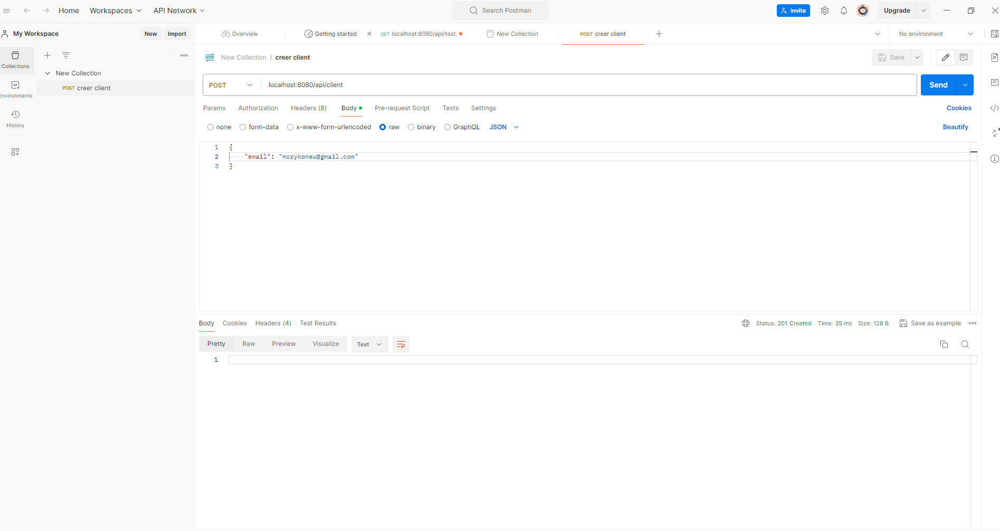
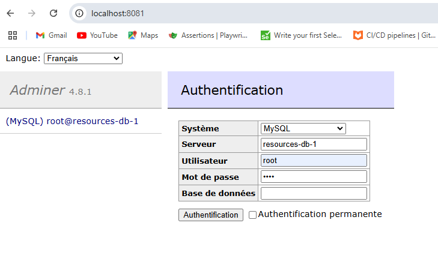
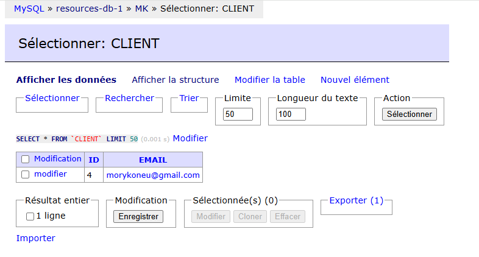

# Backend application with spring boot
This application is an insight of how a backend application works with spring boot. It consists of sending a request from a frontend application which will be treated and registered by the springboot application to the database.
# tools
* Springboot
* Docker
* MariaDB
* Adminer
* Postman
# Installing and setting
To generate a sringboot project: [Spring initilizr](https://start.spring.io/)  
To install docker: [docker](https://www.docker.com/)  
To use maria DB and adminer images: [docker hub](https://hub.docker.com/)
## Docker compose running and stoping
You should run the docker compose in order to use maria DB with adminer.  
To start docker compose: **docker-compose up -d**  
To stop docker compose: **docker-compose stop**
## Open the adminer
You can open the adminer through your localhost:  
**localhost:8081**
## How to connect the database to springboot application
You should create a file **application.properties** where you're going to give a pieces of information about the datasource such as the **url**, the **name**.  
You can have them on this link [common application properties](https://docs.spring.io/spring-boot/appendix/application-properties/index.html). You should looking for **spring.datasource**.  
# Images of the project

